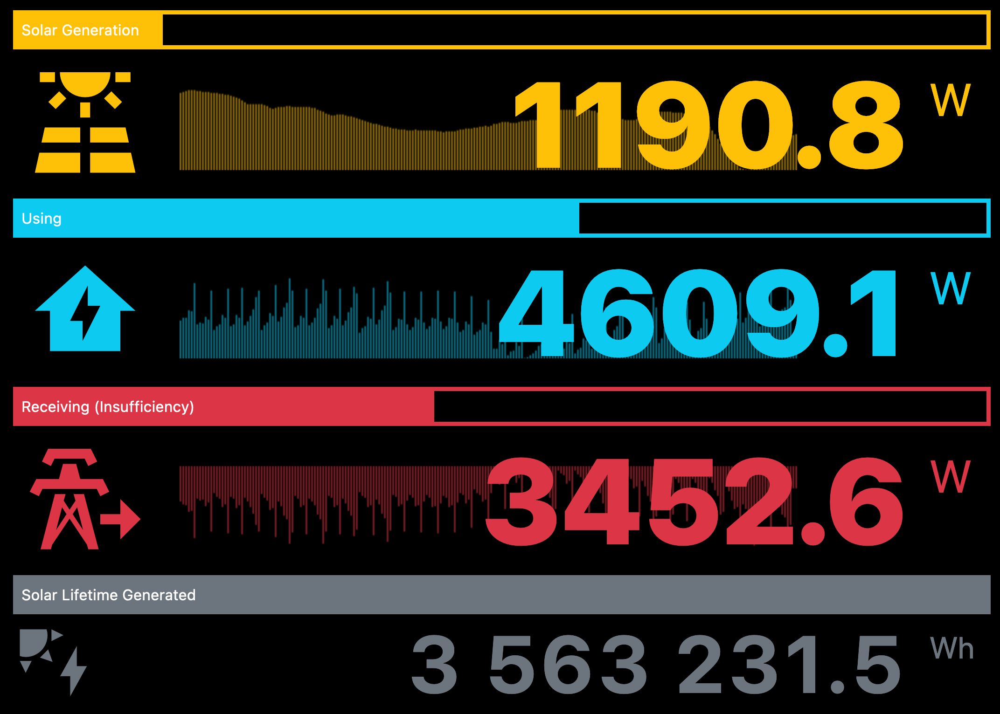

# Energy Imp

An simple web-based energy monitor for viewing electricity generation, consumption, etc.

Built to access the **Fronius Symo GEN24 10.0 Plus** inverter fitted with a **Fronius Piolot GEN24/TAURO** data source and **Fronius PowerMeter** electrical meter.

Other inverters could be supported (see below).

## Setup

#### Config options

Copy the example config file:

    cd app/private
    cp config.EXAMPLE.php config.php

Then edit your config file accordingly `app/private/config.php`:

* `MAX_GEN_CAPACITY_W` - The value in Watts that your system can generate at maximum, e.g. set to `10000` if your system can generate up to 10kW.
* `MODEL` - The model name of your inverter (this must match a supported model).
* `IP` - The IP address of your inverter, e.g. usually a local network address in the format of "192.168.0.123".
* `UPDATE_FREQUENCY_S` - The frequenecy in seconds the browser will poll for updates (default 5s).

## Use

#### Docker

To get the server running use docker-compose:

    docker-compose up -d

#### Accessing it

Point your browser to your Docker instance's IP address and chosen port number, e.g. `http://192.168.0.123:8123` 

If you want to change the port number update `docker-compose.yml` and restart the instance.

## Supporting other inverters

1. Add a class in the format of `app/private/EnergyImp.[MyNewInverter].class.php` (use an existing class as a starting point) and update `getData()` to suit your new inverter's output, matching the standard return array format.

2. In `app/private/EnergyImp.class.php` add an entry for your new class to the `INVERTER_SYSTEMS_SUPPORTED` array.

3. Update `app/private/config.php` setting your new inverter's name and any other required config options to `INVERTER_SYSTEM`.

4. If you want to share; send a pull request so it can be added to this project. :)

## Examples

I run it as a fullscreen webapp on an old iPad for an always on display in my ktichen...

(Using [Apple Configurator](https://support.apple.com/apple-configurator) and a custom profile with a [Web Clip](https://developer.apple.com/documentation/devicemanagement/webclip) URL set to the server's address as a simple way to get an icon on the dock and fullscreen when active.)

